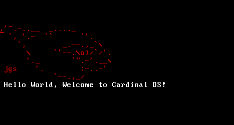

# CardinalOS
<br />
A terminal basd Intel x86 Operating System with a C kernel.
## Building
You will need a GCC cross compiler for i686.
Instructions for installing such a beast can be found here: 
https://wiki.osdev.org/GCC_Cross-Compiler

```bash
$ cd booldr; make; cd ..
$ cd kernel; make; cd ..
$ sudo chmod 755 build.sh
$ ./build.sh
$ qemu-system-i386 -cdrom cardinal.iso # or -kernel cardinal.iso
```
## Commands
	...
## Features
	...
